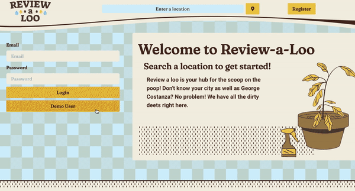

# Review-a-Loo - The Highway Bathroom Cleanliness Review App
Everybody wants it. Everybody needs it. It's finally here! The app to review bathroom cleanliness. Now everyone can be like George Castanza and find the right throne to park at.

Review-a-Loo lets users sign up and start reviewing bathrooms. The search feature implements Google Places' Autocomplete API to select cities to query the Yelp Fusion API. The Yelp Fusion API is called from the server and sends the data to the client where it is displayed using Google Maps and custom React components. The Client is encouraged to leave a review and a rating for a bathroom. 

## MVP
* User Registration
* Search Restrooms by Location
* Map Display for Nearby Restrooms
* Business Profile Page
* Add/Edit/Delete Reviews
* User Profile Page
* User Uploaded Profile Pictures

## BONUS STRETCH GOALS
* Upvote Reviews
* Create a Roadtrip Map
* Create a SideScroller called ToiletTime

## TECHNOLOGY USED
### Client Side
* React
* Google Maps Api
* Chakra Component Library

### Server Side
* Flask / Python Server
* Postgres Database
* SQLAlchemy / Alembic
* Yelp Fusion API
* AWS S3 Storage

## DATABASE TABLES
### USERS
* id (integer, primary key)
* username (string, not null)
* email (string, not null, unique)
* hashed_password (string, not null)

### REVIEWS
* id (integer, primary key)
* stars(integer, not null)
* businessId(integer, foreign key)
* content (string, not null)
* userId (integer, foreign key)
* image (string, nullable)

### BUSINESSES
* id(integer, primary key)
* yelpId (integer, not null, unique, index)
* name (string, not null)
* imageUrl (string, nullable)
* category (string, nullable)
* latitude (numeric, not null)
* longitude (numeric, not null)
* address1 (string, not null)
* city (string, not null)
* phone (string, nullable)
* displayAddress (string, not null)
* yelpUrl (string, nullable)

